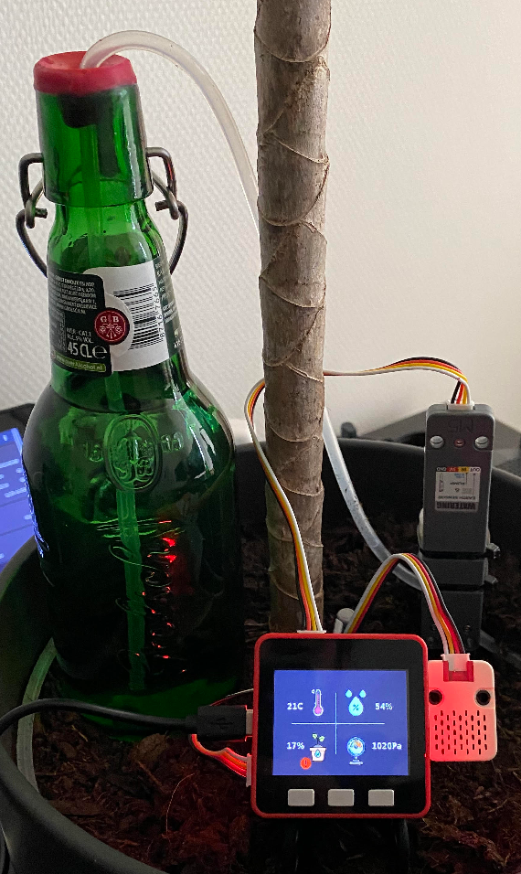
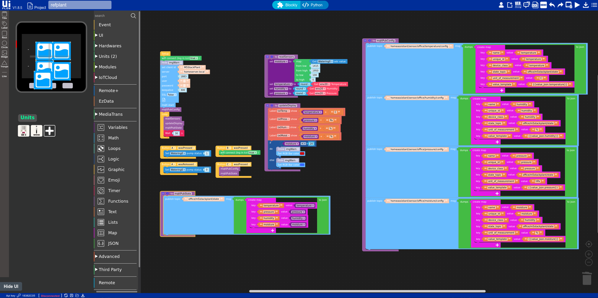

# M5Stack Smart Plant Watering
Using M5Stack to water a plant and report soil moisture, humidity and temperature.

## Features
- Collects soil moisture, air humidity, temperature and pressure
- Button push (A) for watering
- Reuses configued Wifi connection
- Publishes Home Assistant state
- Support Home Assistant auto-discovery
- Reconnect to Wifi with a button (B)
- Send manual MQTT configuration and state with a button (C)
- Signal lack of water with RGB bar (on M5Stack Fire) and warning image

## Prerequisites
### Hardware
- [M5Stack Fire](https://shop.m5stack.com/products/fire-iot-development-kit)
- [ENV II Unit](https://shop.m5stack.com/products/env-ii-unit)
- [Watering Unit](https://shop.m5stack.com/products/watering-unit-with-mositure-sensor-and-pump)

### Software
- [M5Stack UI Flow](https://flow.m5stack.com/)

## Installation
### Hardware
1. Plug the ENV unit in Port A
2. Plug the Watering unit in port B
3. Plant the Watering unit in the soil
4. Connect the internal pipe of the watering unit to a water recipient
5. Put the external pipe of the watering unit in the soil
6. Boot the M5Stack in wifi mode

### Software
1. Download or clone this same repository
2. Open [M5Stack UI Flow](https://flow.m5stack.com/) and connect your M5Stack using the API Key
3. Open the [src/drunken_plant.m5f](src/drunken_plant.m5f) file in [M5Stack UI Flow](https://flow.m5stack.com/)

4. Update the MQTT configuration in the code to suit your own MQTT server.
5. In the readSensors function, update the *from low* and *from high* values according to your [Watering unit calibration](https://makersportal.com/blog/2020/5/26/capacitive-soil-moisture-calibration-with-arduino).
6. Still in UI Flow, use the Manager to upload the code and images to the device.

_Note : Swap Unit Env II with Unit Env III in UI Flow if needed as the former has reached its end of life._

## Usage
- When started, the application connects to the existing Wifi, initiates the MQTT client configuration and publishes the Home Assistant discovery message.
- Every 30 seconds, it reads the sensors values, updates the displayed values and publishes the state messages for Home Assistant on MQTT.
- Press button A to start watering. Release the button to stop.
- Press button B to re-initiate the wifi connection sequence (will be triggered only when disconnected).
- Press button C to manually publish the Home Assistant configuration and sensors state to MQTT.

### TODO
- Icons for button actions
- Watering via MQTT
- Show battery and wifi status